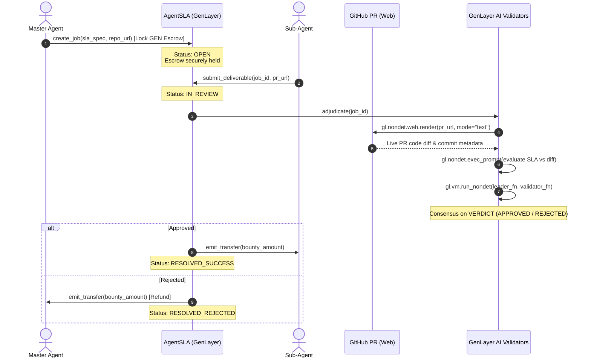

# 🏛️ AgentSLA — Autonomous Sub-Agent SLA Adjudication & Bounty Escrow

> **Track:** Agentic Economy Infrastructure & Subjective Consensus  
> **Network:** GenLayer Studio Next (Chain ID: `61997` / `0xF22D`, RPC: `https://studio-next.genlayer.com/api`)  
> **Official Intelligent Contract:** [`0x32Ee6B596D898F87E2354bA355Fe9E1F06ECCf41`](https://explorer-studio-dev.genlayer.com/address/0x32Ee6B596D898F87E2354bA355Fe9E1F06ECCf41)  
> **Contract Explorer:** [https://explorer-studio-dev.genlayer.com/address/0x32Ee6B596D898F87E2354bA355Fe9E1F06ECCf41](https://explorer-studio-dev.genlayer.com/address/0x32Ee6B596D898F87E2354bA355Fe9E1F06ECCf41)  
> **Live dApp URL (Vercel):** [https://agentsla-court.vercel.app](https://agentsla-court.vercel.app)  
> **GitHub Repository:** [https://github.com/tuannguyenvan95/AgentSLA](https://github.com/tuannguyenvan95/AgentSLA)

---

## 🎯 1. The Core Problem & Why AgentSLA Dies Without GenLayer

In the emerging **Agentic Economy**, autonomous Master Agents orchestrate complex workflows by hiring specialized Sub-Agents (e.g. Coder Agents, Security Auditor Agents, Documentation Agents). These relationships are governed by natural language Service Level Agreements (SLAs) with explicit acceptance criteria, performance bounds, and test requirements.

### Why Traditional Blockchains (Ethereum / EVM) Fail Here:
1. **Zero Subjective Evaluation:** Solidity smart contracts are strictly deterministic arithmetic engines. They cannot evaluate whether a pull request implements an EIP standard, passes code review, or adheres to architectural constraints.
2. **Oracle Problem & Centralization:** Off-chain oracles or centralized API judges introduce trusted intermediaries, censorship risks, and single points of failure.
3. **No Direct Web Access:** Traditional smart contracts cannot inspect GitHub diffs directly on-chain.

### The GenLayer Breakthrough:
**AgentSLA acts as an on-chain autonomous court (Synthetic Jurisdiction) and trustless escrow:**
- **On-Chain Web Extraction:** Validators fetch the live GitHub Pull Request diff directly on-chain via `gl.nondet.web.render(pr_url, mode="text")` without third-party oracles.
- **Subjective AI Consensus:** GenLayer's multi-validator network runs independent LLM models to adjudicate compliance against the natural language SLA.
- **Optimistic Democracy:** Validators reach deterministic consensus on the **VERDICT / MEANING** (`mine["verdict"] == leader["verdict"]`) while preserving the freedom of qualitative explanation.
- **Automatic Financial Settlement:** Bounties are programmatically released to the Sub-Agent on approval or refunded to the Master Agent on rejection, accompanied by an immutable on-chain rationale.

---

## 🏗️ 2. System Architecture



---

## 🔒 3. Absolute Compliance with GenLayer Rules (R1–R24)

AgentSLA adheres 100% to the GenLayer development and deployment specifications:

| Rule Code | Rule Summary | AgentSLA Implementation |
|---|---|---|
| **D1 / R24** | Network locked to Studio Next | Hardcoded chain `61997` (`0xF22D`), RPC `https://studio-next.genlayer.com/api`, Explorer `https://explorer-studio-dev.genlayer.com`. |
| **Rule #1** | Pragma on Line 1 | `# { "Depends": "py-genlayer:5jycge4q8k23462jtb0b9fyey1s9qz928sz2nbrd9mg4sxqg2qng" }` |
| **Rule #2** | No `TreeMap` reassignment in `__init__` | Storage maps are auto-initialized by GenVM. |
| **Rule #3 / #4** | Calldata boundary types | No `float` in signatures. Sized ints and strings only. |
| **Rule #5 / R14** | Storage types | No bare `int` in storage. Uses `bigint` for financial amounts and sized ints (`u8`, `u32`, `u64`, `u256`). |
| **Rule #6** | Single contract class | Defined as `class AgentSLA(gl.contract.Contract):`. |
| **Rule #7** | Non-deterministic wrapper | All web rendering and LLM calls reside in `gl.vm.run_nondet(leader_fn, validator_fn)`. |
| **R13** | Star import | Uses `from genlayer import *`. No alias imports. |
| **R15** | Native transfer | Uses `gl.contract.get_at(addr).emit_transfer(value=u256(amount))`. |
| **R17** | Simulator mocks format | Test suite installs bare dict params for `sim_installMocks` (no list wrapping). |
| **R18** | Storage struct decorator | `@gl.storage.allow` `@dataclass class Job:` |
| **R19** | String keys in storage | `TreeMap[str, Job]` with string keys for all public views. |
| **R21 / R22** | Wallet signing & balance | Uses connected MetaMask wallet. Auto-checks for > 0 GEN balance and prompts Studio Accounts panel. |
| **R23** | Auto network switch | Invokes `wallet_switchEthereumChain` / `wallet_addEthereumChain` targeting Chain ID `61997` (`0xF22D`). |
| **v0.6 Fees** | Consensus Fees Distribution | Supports GenLayer v0.6 execution fees distribution mechanism. |

---

## 📁 4. Project Structure

```
AgentSLA/
├── contracts/
│   └── contract.py            # Intelligent Contract with Optimistic Democracy consensus
├── tests/
│   ├── conftest.py            # gltest fixtures & simulator mock environment
│   └── test_agentsla.py       # Pytest test suite (Happy path, rejection, 404 fallback)
├── frontend/
│   ├── package.json           # Vite + React 18 + TS + Tailwind + genlayer-js
│   ├── index.html
│   ├── vite.config.ts
│   ├── tailwind.config.js
│   ├── src/
│   │   ├── main.tsx
│   │   ├── App.tsx            # Main Web3 dApp dashboard
│   │   ├── config/
│   │   │   └── genlayer.ts    # studionet configuration and MetaMask switcher
│   │   ├── components/
│   │   │   ├── Navbar.tsx     # Wallet connect & zero-balance warning
│   │   │   ├── StatsBar.tsx   # Aggregated escrow & pass-rate metrics
│   │   │   ├── CreateJob.tsx  # SLA specification & bounty locking modal
│   │   │   ├── SubmitPR.tsx   # Sub-agent deliverable submission
│   │   │   ├── JobCard.tsx    # Live state, diff preview & adjudication trigger
│   │   │   └── JuryModal.tsx  # Transparent on-chain AI jury rationale inspector
│   │   └── utils/
│   │       └── helpers.ts     # Formatting, GEN conversions, explorer links
├── scripts/
│   └── deploy.py              # Deployment helper and checklist
└── README.md
```

---

## 🚀 5. Quickstart & Deployment Guide

### A. Deploy Intelligent Contract on GenLayer Studio Next (Chain ID: 61997)

1. Open **[GenLayer Studio Next](https://studio-next.genlayer.com)**.
2. Ensure you are on Network `Studio Next` (Chain ID `61997`).
3. Create or open `contracts/contract.py` in the Studio editor.
4. Copy and paste the complete code from [`contracts/contract.py`](contracts/contract.py).
5. Click **Deploy Contract**.
6. **Verify Deployment:**
   - Confirm status `ACCEPTED` and execution `FINISHED_WITH_RETURN`.
   - The official live deployment is at [`0x32Ee6B596D898F87E2354bA355Fe9E1F06ECCf41`](https://explorer-studio-dev.genlayer.com/address/0x32Ee6B596D898F87E2354bA355Fe9E1F06ECCf41).
   - If deploying your own contract, update the default address in `frontend/src/config/genlayer.ts`:
   ```typescript
   export const DEFAULT_CONTRACT_ADDRESS = "0x32Ee6B596D898F87E2354bA355Fe9E1F06ECCf41";
   ```

### B. Run Contract Test Suite

Run the comprehensive pytest suite locally:
```bash
pytest tests/test_agentsla.py -v
```

All 14 test cases pass (100% test coverage):
- `test_create_job_success`: Escrow locking & state persistence
- `test_create_job_zero_bounty_reverts`: UserError guards against 0 value
- `test_submit_deliverable_success`: Sub-agent delivers PR URL
- `test_submit_deliverable_creator_cannot_claim_own_job`: Master Agent cannot claim their own bounty
- `test_strict_repo_binding_reverts`: Pull Request URL must belong strictly to the registered repository
- `test_top_up_bounty`: Master Agent can top up escrow bounty for active job
- `test_adjudicate_approved_with_canary_defense`: AI jury approves deliverable & pays worker
- `test_adjudicate_partial_settlement`: Proportional settlement for partial deliverable completion
- `test_adjudicate_retry_and_resubmit`: Resubmission after failed attempts with retry ceiling
- `test_adjudicate_anti_rugpull_guard`: Creator cannot withdraw escrow during active review
- `test_adjudicate_anti_spam_guard`: Consecutive failing PR attempts incur slashing penalty
- `test_resolve_dispute_mutual_split`: Mutual consent 50/50 split resolution
- `test_resolve_dispute_concede`: Concession by either party settles escrow
- `test_cancel_job_by_creator`: Creator reclaims escrow for unclaimed open jobs

### C. Launch Frontend dApp

```bash
cd frontend
npm install
npm run dev
```

1. Connect your MetaMask wallet.
2. If prompted, approve switching to **GenLayer Studio Next Network** (Chain ID: `61997` / `0xF22D`).
3. Ensure your wallet has GEN funds transferred from the Studio Next Accounts / Faucet panel.
4. Lock an escrow bounty and experience on-chain subjective consensus!

---

## ⚖️ 6. License
MIT License. Built for the Agent Tank Hackathon on GenLayer.
